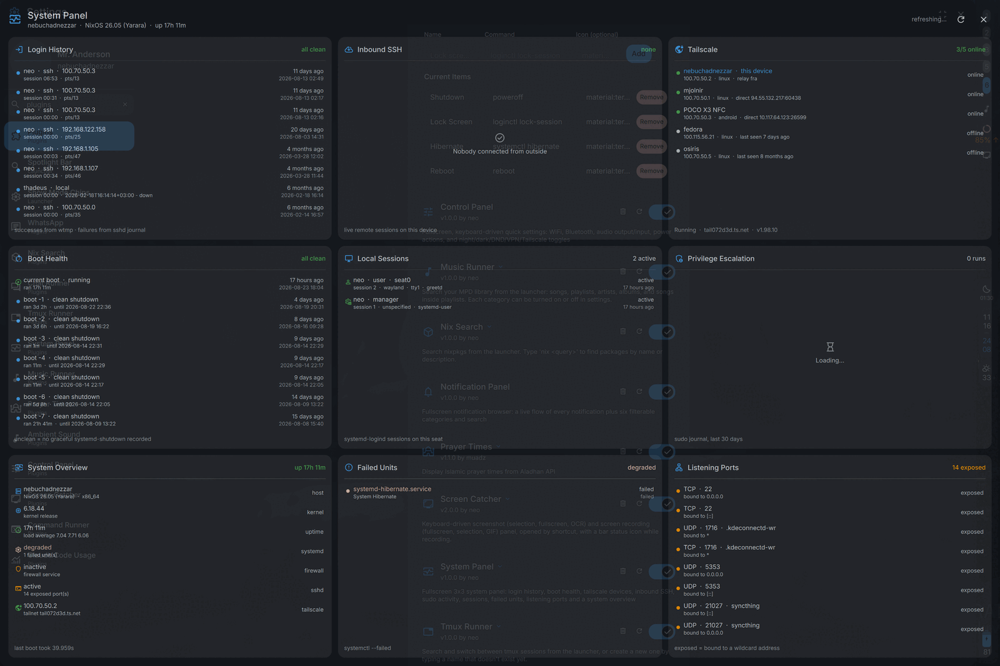
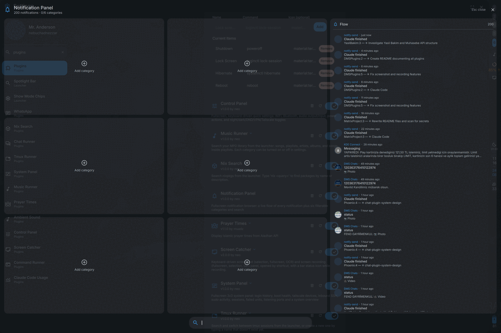
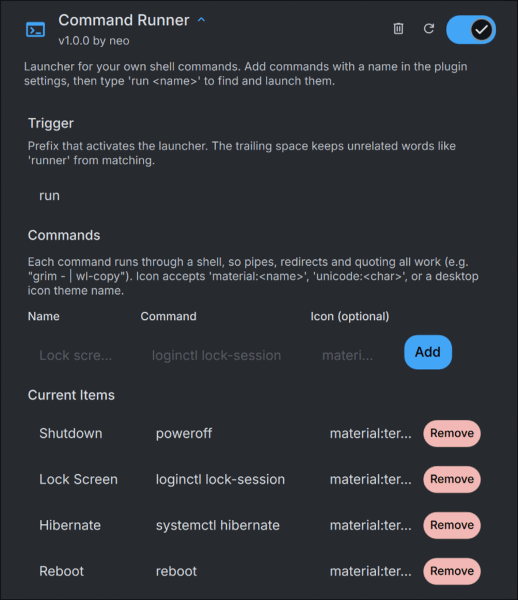
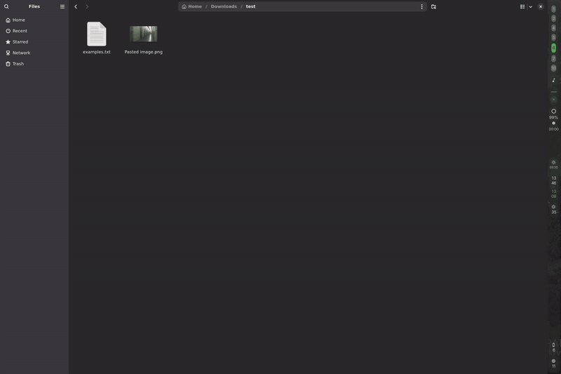
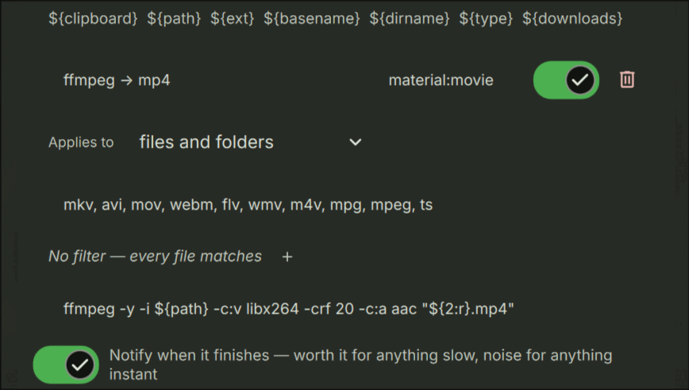

# DMS Plugins

Plugins for [DankMaterialShell](https://github.com/AvengeMedia/DankMaterialShell).

Fourteen plugins in four shapes: **launcher** plugins that answer a trigger word
you type into the launcher, **panels** that open fullscreen over the shell on a
keybind, a **chat provider** that connects an outside messaging service to the
DMS chat system, and an **overlay** that replaces a piece of shell chrome.

| Plugin | Shape | How you reach it | Needs |
|---|---|---|---|
| [commandRunner](commandRunner/) | launcher | `run <name>` | — |
| [clipboardRunner](clipboardRunner/) | launcher | `clip <name>` | `yt-dlp`, `aria2`, `ffmpeg`, `imagemagick`, … |
| [tmuxRunner](tmuxRunner/) | launcher | `tmux <name>` | `tmux`, a terminal |
| [sshManager](sshManager/) | launcher + daemon | `ssh <name>` | an ssh client, a terminal |
| [musicRunner](musicRunner/) | launcher | `mpd <query>` | `mpc` |
| [nixSearch](nixSearch/) | launcher | `nix <query>` | `nix` (flakes) |
| [chatRunner](chatRunner/) | launcher | `c <name/number>` | a chat provider |
| [screenCatcher](screenCatcher/) | panel + bar widget | keybind / IPC | `grim`, `slurp`, `wf-recorder` |
| [systemPanel](systemPanel/) | panel + bar widget | keybind / IPC | — |
| [notificationPanel](notificationPanel/) | panel + bar widget | keybind / IPC | — |
| [notificationLine](notificationLine/) | overlay | every notification | — |
| [whatsappChat](whatsappChat/) | chat provider | the DMS chat window | Go, to build |
| [signalChat](signalChat/) | chat provider | the DMS chat window | Go, to build; `signal-cli` |
| [matrixChat](matrixChat/) | chat provider | the DMS chat window | Go, to build |

Every plugin has its own README with the full detail — the sections below are
summaries of what each one is for and what it needs.

| | |
|---|---|
| [](systemPanel/) | [](notificationPanel/) |
| **[systemPanel](systemPanel/)** — who has touched this machine, and is it healthy | **[notificationPanel](notificationPanel/)** — every notification, filtered six ways at once |

## Install

**clipboardRunner is in the [DMS plugin registry][registry]**, so it installs
itself:

```sh
dms plugins install clipboardRunner
```

It is also in **Settings → Plugins → Browse**, which is the same thing with a
list to scroll. The rest of the plugins here are not in the registry yet;
install those from a clone, below.

[registry]: https://github.com/AvengeMedia/dms-plugin-registry

### From a clone

Plugins live in `~/.config/DankMaterialShell/plugins/`. Symlinking from a clone
means `git pull` updates them in place, and the directory is watched, so they
appear without restarting the shell.

```sh
git clone git@github.com:by-architect/DMS-Plugins ~/src/dms-plugins
cd ~/src/dms-plugins

ln -sfn "$PWD/screenCatcher" ~/.config/DankMaterialShell/plugins/screenCatcher
ln -sfn "$PWD/nixSearch"     ~/.config/DankMaterialShell/plugins/nixSearch
# …one line per plugin you want
```

Then enable each under **Settings → Plugins** (or **Settings → Chats**, for
chat providers). Removing a symlink uninstalls the plugin.

If a new plugin does not show up on its own, trigger a rescan:

```sh
dms ipc call plugin-scan scan
```

Without the `dms` CLI on your PATH, go through the running quickshell instance
instead — every `dms ipc call …` below has this longer equivalent:

```sh
SHELL_PATH=$(quickshell list --all | grep -oE '/[^ ]*/shell\.qml' | head -1)
quickshell -p "$SHELL_PATH" ipc call plugin-scan scan
```

**whatsappChat, signalChat and matrixChat need one extra step** — their
bridges are compiled, see their sections below. matrixChat needs a second:
`./login.sh`, because Matrix has no QR code to scan.

A plugin with unmet dependencies refuses to activate and says which binary is
missing, rather than enabling and failing quietly later.

---

# Launcher plugins

Each one owns a trigger word. Type it in the launcher, followed by a space,
then your query. The trailing space is deliberate everywhere: it stops `nix `
from firing on `nixos-rebuild` and `run ` on ordinary words. Every trigger is
configurable in that plugin's settings.

Right-click (or the action panel) on any result shows its full action list;
`Enter` runs the first one.


## commandRunner — `run <name>`

Your own shell commands, named and searchable. Add them under **Settings →
Plugins → Command Runner → Commands**: a name, a command, an optional icon.
Commands run through `sh -c`, so pipes, redirects and quoting all work.

```
run lock       →  runs "Lock screen", if that's what you named it
run            →  lists every configured command
```

Commands live in the plugin's settings rather than in this repo, so nothing
here needs editing to add one.

They run exactly as typed with no sanitization — that is the point of a
personal command launcher, but don't paste in commands you wouldn't otherwise
run.



→ [commandRunner/README.md](commandRunner/README.md)

## tmuxRunner — `tmux <name>`

Find a running tmux session and attach to it, or type a name that doesn't exist
yet and create it. Attaching opens your terminal running `tmux attach-session`,
since that needs an interactive TTY the launcher can't provide.

```
tmux            →  every running session
tmux new-thing  →  no session by that name → offers  Create "new-thing"
```

Existing sessions are always offered before the "create" fallback. Right-click
a session for **Copy session name** or **Kill session**.

With [sshManager](sshManager/) installed, its hosts are searchable here too —
selecting one without a running session yet opens `ssh` as a tmux session's
command instead of a plain shell, so the connection survives a detach.

Needs `tmux` and a terminal emulator. Eleven common terminals are auto-detected
(ghostty, kitty, alacritty, foot, wezterm, …); anything else falls back to `-e`,
or set the exec flags yourself.

→ [tmuxRunner/README.md](tmuxRunner/README.md)

## sshManager — `ssh <name>`

A list of SSH connections — name, host, port, username, auth method — entered
once in settings and shared two ways: this plugin's own launcher, and a small
API any other plugin (a runner, say) can call to build the same connection.

```
ssh            →  every configured host
ssh prod       →  hosts matching "prod" by name, address or username
```

Connecting always opens a terminal running plain `ssh` with the host's
non-secret fields filled in — port, identity file, `user@host`. Password auth
is never fed to `ssh` automatically here; it prompts for it interactively,
same as typing the command by hand. A password can still be *stored*, for
other plugins that want to drive `ssh` non-interactively themselves — see
this plugin's README for exactly where that's kept and how to reach it as a
consumer.

→ [sshManager/README.md](sshManager/README.md)

## musicRunner — `mpd <query>`

Search an MPD library across six categories at once — songs, playlists,
artists, albums, songs *inside* playlists, and the current queue — in one
ranked list. Every category has its own on/off toggle, and a short prefix
scopes one search to one category regardless of those toggles:

```
mpd kanye        →  songs, artist and albums together
mpd l rap        →  only playlists ("Lists")
mpd q solo       →  only what's already queued ("Now Playing")
```

Selecting a result replaces the queue and plays, by default — picking a result
usually means "play this now". **Add to end of queue** and **Add after current
song** are one right-click away.

Needs `mpc` on PATH. MPD itself does *not* need to be reachable to enable the
plugin — a server rebooting is a normal recoverable state, not a reason to
block activation. When MPD is unreachable the launcher says so, with the actual
reason and a retry, and clears itself the moment it comes back.

→ [musicRunner/README.md](musicRunner/README.md)

## nixSearch — `nix <query>`

Search nixpkgs by package name and description, via `nix search --json`.

```
nix firefox      →  firefox, firefox-esr, firefox-mobile, …
nix json cli     →  packages matching both words
```

The first search evaluates all of nixpkgs and takes about a minute; every
search after that reuses the eval cache and takes a couple of seconds. Because
that first run is the expensive part, an in-flight search is never killed to
start a newer one — the newest query queues up behind it instead. Results are
ranked locally so that top-level attributes beat `haskellPackages.*` and
`python3Packages.*` ones, and per-query results are cached, so backspacing is
instant.

`Enter` copies the attribute by default; the setting also offers copying
`nixpkgs#attr`, a `nix run` line, or opening search.nixos.org. Needs `nix` with
`nix-command` and `flakes` — the plugin passes those features itself, so it
works where they aren't enabled globally.

→ [nixSearch/README.md](nixSearch/README.md)

## chatRunner — `c <name, number or address>`

Every conversation, from every installed chat provider, in one list. Selecting
a row opens that conversation on its own.

```
Ada Lovelace     WhatsApp  ·  2 unread  ·  +905551234567
Ada Lovelace     Mail
Katherine        WhatsApp  ·  no messages yet
```

Every row states which service it belongs to, because two people can share a
name and one person can be on two services — you tell them apart by reading the
row, not by guessing. Matching happens in the DMS backend, so this plugin knows
nothing about any particular service: names, phone numbers in any formatting,
email addresses and exact conversation ids all work. Numbers match against the
**handles** a provider declares, never by picking apart a conversation id
(WhatsApp ids contain no phone number at all).

Contacts you have never written to are listed too, so you can start a
conversation from here; turn that off in settings if you'd rather see only
chats with history.

Needs at least one chat provider enabled under **Settings → Chats** — see the
chat section below. With none, the runner says so rather than showing an empty
list.

→ [chatRunner/README.md](chatRunner/README.md)

## clipboardRunner — `clip <name>`

Your own commands, run against whatever is on the clipboard. Every action is
filed under one of four kinds of content, and only the actions that fit what
you copied are offered:

```
copy https://youtube.com/watch?v=…   then  clip  →  yt-dlp, mpv, send to phone
copy #ff0080                         then  clip  →  set accent, name this colour
copy /home/you/holiday.mkv           then  clip  →  play, transcode, share
copy anything else                   then  clip  →  translate, define, pastebin
```



51 actions come with it — yt-dlp and `sm music install` for YouTube and Deezer
links, aria2c for magnets, clone / `pm create` / fork for GitHub, ffmpeg and
imagemagick conversions for audio, video and images, libreoffice for documents,
framework detection and `adb install` for APKs, AppImage installation, 7z and
tar for folders and archives, colour conversions, and a virus scan. They are seeded into your list as ordinary
entries, so they are all editable.

An action carries filters — `includes`, `excludes`, `is exactly`, `starts with`,
a regex, and so on — so `includes youtube.com` under **Link** never fires for
any other site. File actions can also be narrowed by extension.



Everything runs through zsh, detached, with no terminal, and posts a
notification when it finishes. Copying is not a trigger: nothing runs until you
open the launcher and pick something. Clipboard text reaches the command as an
argument rather than as part of the script, so a copied `; rm -rf ~` is a
strange argument and not a second command.

→ [clipboardRunner/README.md](clipboardRunner/README.md)

---

# Panels

Fullscreen overlays rather than bar dropdowns. Each ships an optional bar
widget, but the panel is the plugin — bind its IPC call to a key under
**Settings → Keybinds → Add → Spawn** and the widget becomes optional.

```sh
dms ipc call <plugin> toggle    # also: open, close, status
```

`status` reports whether the panel holds keyboard focus, which is what you want
when a compositor is doing something odd with focus.

## screenCatcher

Screenshots and screen recording from a centered, keyboard-first panel: open it
with a shortcut, press a letter, done.

| | |
|---|---|
| `S` / `F` / `T` | Screenshot selected / fullscreen / to text (OCR) |
| `R` / `D` / `G` | Record fullscreen / selected / selected as GIF |
| `X` | Stop recording — also cancels one still waiting on a selection |
| `M` / `Y` | Toggle microphone / system audio |
| `1` `2` / `3` `4` | Image format PNG/JPEG · recording format MP4/MKV |
| `C` `P` / `B` `V` | Where screenshots · recordings go (clipboard / kept file) |

Every action also has its own IPC command, so any subset can be bound directly
without opening the panel — `stop` is the one worth binding on its own, as a
global "kill whatever's recording" key.

Two independent destination toggles per kind, because wanting a screenshot on
the clipboard is routine while wanting a whole video there is not. With "keep
the file" off, the capture goes to a scratch directory, onto the clipboard, and
the scratch directory is deleted.

"Fullscreen" means **the screen you are on** — the focused output is detected
and passed explicitly, for both screenshots and recording. Multi-monitor
recording without that hangs forever, since `wf-recorder` prompts interactively
for an output when several exist.

The bar widget is status-only: idle icon, or a pulsing red dot with an elapsed
timer while recording, plus an inline stop button on horizontal bars.

Requires `grim`, `slurp` and `wf-recorder`. `ffmpeg` is required for GIF only;
`tesseract` (OCR), `wl-clipboard`, `notify-send`, `jq` and PipeWire's
`pw-dump`/`pw-loopback` (audio) each degrade gracefully when absent.

→ [screenCatcher/README.md](screenCatcher/README.md)

## systemPanel

A 3×3 panel answering "who has touched this machine, and is it healthy?"

| | | |
|---|---|---|
| Login history | Inbound SSH | Tailscale devices |
| Boot health | Local sessions | Privilege escalation (sudo) |
| System overview | Failed units | Listening ports |

Everything runs as the logged-in user — no root, no helper daemon. Failed
logins come from the journal rather than `lastb`, because `/var/log/btmp` is
root-only; nothing is lost, since sshd records invalid users and failed auth
there. A boot counts as **unclean** when its boot id never logged a
`systemd-shutdown` message, and error context is fetched only for those.

Inside the panel: **Esc**/**q** closes, **Ctrl+R**/**F5** refreshes. Collectors
re-run every 30s while it's open, and the journal lookback is a setting
(30 days by default).

→ [systemPanel/README.md](systemPanel/README.md)

## notificationPanel

A fullscreen notification browser: a live flow of every notification on the
right, six filtered categories on the left, and a search bar that narrows all of
them at once.

Categories get a rule builder rather than a text box — each is a list of
conditions (field, mode, value) that must all match, with a live match count as
you type. The search bar stays free text for quick one-off narrowing, with
whitespace-separated tokens ANDed together:

| Token | Matches |
|---|---|
| `whatsapp` | title, body or app name |
| `title:` / `app:` / `body:"two words"` | one field only |
| `urgency:critical` | `low`, `normal` or `critical` |
| `-app:spotify` | negation |

Everything is read from the same persisted history list the shipped
Notification Center renders — it survives shell restarts, needs no polling, and
deleting a card removes it from every other view too. It is a browse-and-filter
surface over that history, not a replacement for the popup flow: acting on a
live notification's buttons needs the transient object, which is gone once the
sender disconnects.

The search bar takes focus on open, so typing filters immediately. **Esc**
closes from anywhere; **q** closes too, but only when the search field isn't
focused.

→ [notificationPanel/README.md](notificationPanel/README.md)

## notificationLine

Notifications as chat lines instead of cards — one notification, one line,
stacked in a screen corner the way Minecraft's chat overlay stacks messages:

```
 4m  [] discord    Someone   →  are you coming to the thing tonight or …  ⌄
```

A line is only as wide as its text, up to half the screen. Past that the title
and body are elided and a `⌄` appears; clicking it unfolds that line in place
into a wrapped, multi-line version with the notification's action buttons
underneath, and stops the expiry timer while you read. Hovering pauses the
timer, left click fires the default action, middle click dismisses.

It is a different *view*, not a different notification system: it renders
`NotificationService.visibleNotifications`, so per-app rules, dedupe, Do Not
Disturb, history and the notification centre all behave exactly as they did.
Expiry is the one thing it takes over, so that a line's lifetime comes from
your settings rather than from whatever timeout the sending app asked for —
or from a single flat duration, if you prefer every line to behave the same.

Because DMS has no switch for turning its own popup cards off, the plugin does
it by pointing the shell's notification monitor list at a screen name that
cannot exist, and puts the old value back when it is disabled or removed.

Keybind targets for clearing the stack, and for dismissing or recalling one
line at a time, are on its IPC handler.

→ [notificationLine/README.md](notificationLine/README.md)

---

# Chat

DMS has a chat system that knows nothing about any particular messaging
service. Providers arrive as plugins, and each ships a **bridge**: a small
program that translates its service into newline-delimited JSON. The DMS
backend owns the message store, unread counts, the attachment cache,
notifications and search, so a bridge only has to speak its protocol.

**whatsappChat**, **signalChat** and **matrixChat** are three such providers.
**chatRunner** is not a provider at all — it's the launcher that lists whatever
providers you have installed.

```
                                          ┌── whatsappChat bridge ──▶ WhatsApp
    chatRunner ──┐                        │
                 ├──▶  DMS chat backend ◀─┼── signalChat bridge ────▶ Signal
    chat window ─┘   (store, notifications,│
                      search)              └── matrixChat bridge ────▶ Matrix
```

No bridge knows the others exist, and the shell knows none of the three
services. That is the whole point of the arrangement: a fourth provider is a
fourth bridge, and nothing here changes to accommodate it.

The three are deliberately different shapes, which is the useful part: WhatsApp
speaks its own protocol through a library, Signal is reached by driving
`signal-cli` as a child process, and Matrix is a plain HTTP API the bridge calls
directly. All three arrive at the same contract.

So chatRunner on its own shows an empty list. Install a provider first.

This needs a DMS build with chat support. Check with `dms chat providers` — if
that reports an unknown command, your DMS predates the chat system. You also
want **wl-clipboard** (`wl-copy`, `wl-paste`) for pasting attachments into the
composer and copying them out.

## whatsappChat

Links WhatsApp as a device, the same way WhatsApp Web does, using
[whatsmeow](https://github.com/tulir/whatsmeow).

Its bridge is Go and must be compiled for the machine it runs on, so it isn't
shipped prebuilt:

```sh
cd ~/src/dms-plugins/whatsappChat
./build.sh
```

Once after installing, and again after every update. The plugin refuses to
enable until the binary exists and says so, rather than sitting silently at
"disconnected".

Then **Settings → Chats → WhatsApp** to enable it, and scan the QR code that
appears with your phone under *Settings → Linked devices → Link a device*.
First sync pulls your history and may take a few minutes.

Text, replies, photos, video, voice notes, documents, stickers, location and
contact cards all work, in direct and group conversations, along with read
receipts and delete-for-everyone in both directions. Search is local — the DMS
store indexes messages; WhatsApp has no server-side search. Reactions, polls,
calls and status updates aren't modelled by the contract yet. Newsletters and
broadcast lists are filtered out: they're feeds, and in a busy account they
bury real conversations.

**Media is not downloaded during history sync.** A year of photos is gigabytes
nobody asked for, so WhatsApp's own embedded thumbnail shows immediately and
the full file is fetched only when you open it. The bridge remembers the last
4000 attachments in order to do that; older ones ask you to reopen the
conversation.

→ [whatsappChat/README.md](whatsappChat/README.md)

## Using the chat window

```sh
dms ipc call chats toggle                  # the full window, with the chat list
dms ipc call chats popout "Ada"            # one conversation, by name
dms ipc call chats popout "+905551234567"  # or by number
dms ipc call chats cycle                   # walk unread conversations
```

Worth binding under Settings → Keyboard Shortcuts.

In a conversation the text field always holds focus, so typing always goes
there:

| | |
|---|---|
| `Enter` | Send |
| `Alt+K` / `Alt+J` | Move the selection through messages |
| `Shift+Enter` | Open the selected message's attachment or link |
| `Ctrl+Shift+C` | Copy the selected message, or its attachment as a file |
| `Alt+R` / `Alt+F` | Reply / forward |
| `Delete` / `Shift+Delete` | Delete for you / for everyone, after confirming |
| `Ctrl+V` | Attach an image or file from the clipboard |
| `Esc` | Close |

Attachments are pasted rather than browsed for: copy a file in a file manager,
or an image from a screenshot tool, and paste. A pasted or typed path followed
by a space is attached too. Everything staged shows as a thumbnail above the
text field, so you can drop one before sending.

## Keeping the conversation list manageable

A WhatsApp account is mostly not conversations — statuses, channels, broadcast
lists and archived chats crowd out the rest. Each provider declares what its
conversations are, and **Settings → Chats → WhatsApp → Chat filters** turns each
category on or off for the conversation list and the runner. Hiding is only
hiding: searching still finds them, and nothing is deleted.

Notifications are separate, and per provider: on or off, previews, groups,
archived, do not disturb, and one toggle per category — so a service's statuses
can be silent without silencing the service.

## Where your data lives

| What | Where | Owner |
|---|---|---|
| WhatsApp session — the linked device itself | `~/.local/share/dms-whatsapp/session.db`, mode 0600 | whatsappChat |
| Messages and conversations | `~/.local/share/DankMaterialShell/chat/history.db` | DMS |
| Cached attachments | `~/.cache/DankMaterialShell/chat/media/` | DMS |
| Plugin settings | `~/.config/DankMaterialShell/plugin_settings.json` | DMS |

**The session database is your WhatsApp account.** Anyone who can read it can
read your messages. Keep it out of dotfile repos and shared backups.

To unlink, use *Sign out* in Settings → Chats, or remove the device from your
phone. Deleting the file locally leaves the device still linked on WhatsApp's
side.

## When something is wrong

```sh
dms chat providers              # what DMS found, and each one's state
dms chat status whatsappChat    # connection state, capabilities, restarts, stderr
dms chat tail whatsappChat      # live protocol traffic in both directions
```

`tail` is the useful one: a bridge runs as a child of the daemon, so without it
its output is invisible.

| Symptom | Usually |
|---|---|
| Plugin will not enable | The bridge is not built — run `./build.sh` |
| Stuck at "disconnected" | Check `dms chat status` for the error |
| Runner lists nothing | No provider is enabled, or everything is filtered out |
| Searching a number finds nothing | Handles arrive when the bridge connects; reconnect once |
| No Chats section in Settings | DMS was built without chat support |

---

## A note on trust

These plugins run as your user, with your permissions. So do all DMS plugins —
there is no sandbox. Four are worth naming specifically:

- **commandRunner** runs what you configure, verbatim and unsanitized. That's
  the point of a command launcher, and anyone who can write its settings could
  already run commands as you.
- **systemPanel** reads the journal, wtmp, systemd and `ss` — all as your own
  user, no root and no helper daemon — and displays who has logged into the
  machine. Treat the panel as you'd treat that output.
- **sshManager** can hold a plaintext password per host, deliberately kept out
  of the ordinary settings file but still just a 0600 file on disk. Any other
  enabled plugin can ask for it — there's no extra gate beyond being enabled
  at all. Prefer key-based auth; it's the default.
- **whatsappChat** holds your WhatsApp session and talks to WhatsApp's servers.
  It uses [whatsmeow](https://github.com/tulir/whatsmeow), the library most
  third-party WhatsApp clients are built on. WhatsApp does not sanction
  third-party clients, and accounts have been restricted for using them. It
  works, and has for years, but the risk is yours to weigh.

## Writing your own

For launcher and panel plugins, the shipped ones here are the working examples
— each README has an *Implementation notes* section covering the non-obvious
parts of the plugin system (a `PanelWindow` declared inline never becomes a
layer surface; Hyprland ignores layer-shell exclusive keyboard focus; the
launcher's `getItems()` is synchronous, so slow sources must cache and
re-request).

For a chat provider, the contract is `docs/CHAT-PLUGINS.md` in the
DankMaterialShell repository, and `quickshell/PLUGINS/EchoChatExample/` there is
a complete working bridge in about 300 lines. A bridge can be written in any
language — it reads JSON lines on stdin and writes them on stdout.
