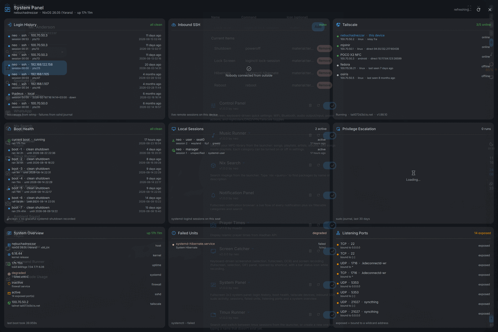
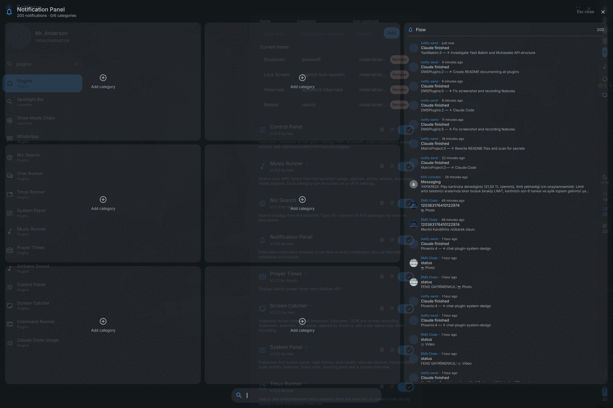
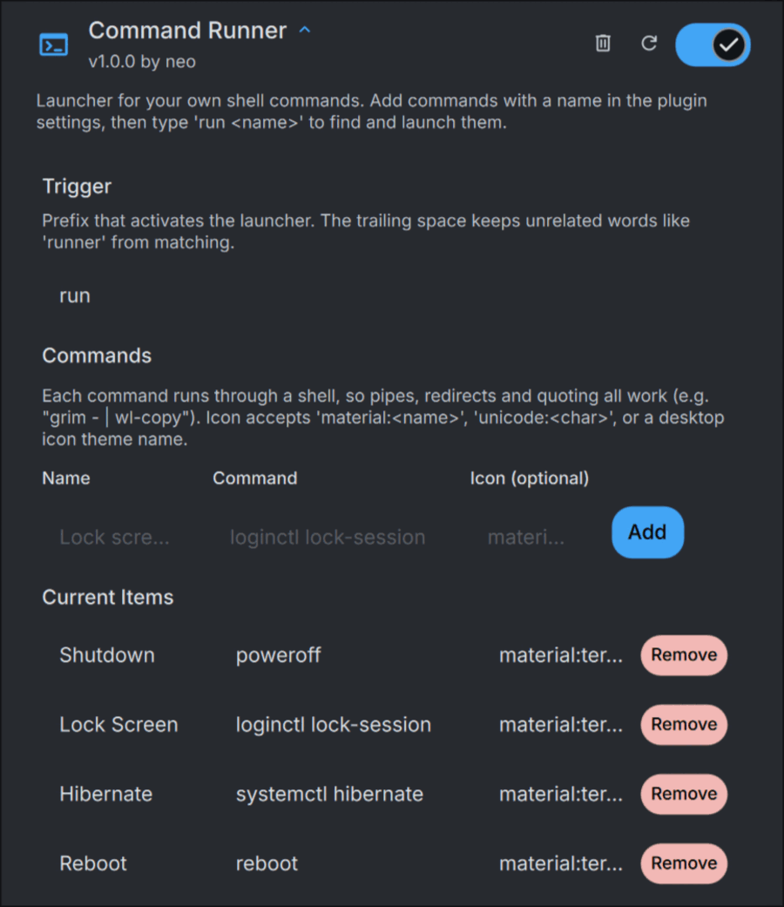
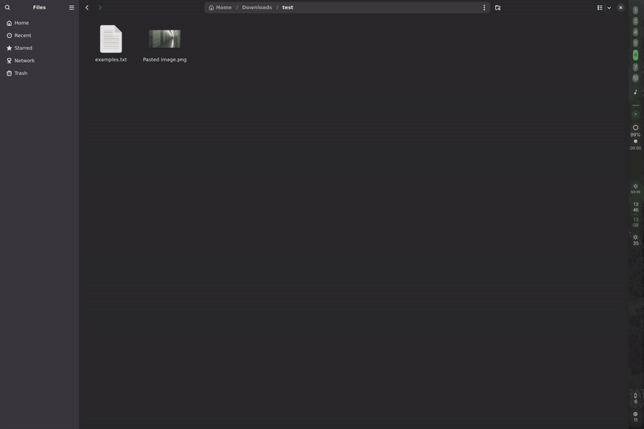
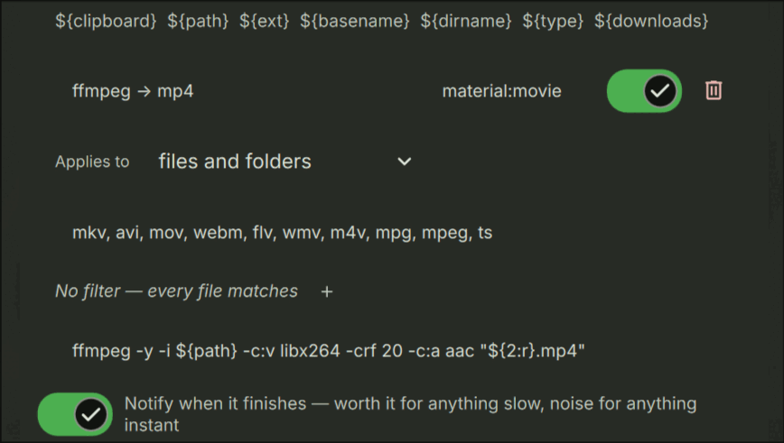

# DMS Plugins

Plugins for [DankMaterialShell](https://github.com/AvengeMedia/DankMaterialShell).

Twenty-two plugins in six shapes: **launcher** plugins that answer a trigger word
you type into the launcher, **panels** that open fullscreen over the shell on a
keybind, **bar widgets** that live in the bar and open a popout under themselves,
the **chat manager** that is the chat system itself, **chat providers** that
connect an outside messaging service to it, and an **overlay** that replaces a
piece of shell chrome.

| Plugin | Shape | How you reach it | Needs |
|---|---|---|---|
| [commandRunner](commandRunner/) | launcher | `run <name>` | — |
| [clipboardRunner](clipboardRunner/) | launcher | `clip <name>` | `yt-dlp`, `aria2`, `ffmpeg`, `imagemagick`, … |
| [tmuxRunner](tmuxRunner/) | launcher | `tmux <name>` | `tmux`, a terminal |
| [sshManager](sshManager/) | launcher + daemon | `ssh <name>` | an ssh client, a terminal |
| [musicRunner](musicRunner/) | launcher | `mpd <query>` | `mpc` |
| [nixSearch](nixSearch/) | launcher | `nix <query>` | `nix` (flakes) |
| [processRunner](processRunner/) | launcher | `kill <name>` | `ps`, a standalone `kill` |
| [chatRunner](chatRunner/) | launcher | `c <name/number>` | chatManager and a chat provider |
| [screenCatcher](screenCatcher/) | panel + bar widget | keybind / IPC | `grim`, `slurp`, `wf-recorder` |
| [systemPanel](systemPanel/) | panel + bar widget | keybind / IPC | — |
| [notificationPanel](notificationPanel/) | panel + bar widget | keybind / IPC | — |
| [controlPanel](controlPanel/) | panel + bar widget | keybind / IPC | — |
| [wallpaperSearch](wallpaperSearch/) | panel + bar widget | keybind / IPC | `curl` |
| [notificationLine](notificationLine/) | overlay | every notification | — |
| [fileActions](fileActions/) | bar widget | the pill, and its popout | `fct`, or any writer of per-action status files |
| [mountManager](mountManager/) | bar widget | the pill, and its popout | `lsblk`, `udisksctl` |
| [processWidget](processWidget/) | bar widget | the pill, and its popout | `ps` |
| [hostStatus](hostStatus/) | bar widget | the pill, and its popout | sshManager, `ssh`; `sshpass` for password hosts |
| [chatManager](chatManager/) | chat window + daemon | keybind / IPC, notifications, chatRunner | Go, to build |
| [whatsappChat](whatsappChat/) | chat provider | the chat window | chatManager; Go, to build |
| [signalChat](signalChat/) | chat provider | the chat window | chatManager; Go, to build; `signal-cli` |
| [matrixChat](matrixChat/) | chat provider | the chat window | chatManager; Go, to build |

Every plugin has its own README with the full detail — the sections below are
summaries of what each one is for and what it needs.

| | |
|---|---|
| [](systemPanel/) | [](notificationPanel/) |
| **[systemPanel](systemPanel/)** — who has touched this machine, and is it healthy | **[notificationPanel](notificationPanel/)** — every notification, filtered six ways at once |

## Install

**clipboardRunner is in the [DMS plugin registry][registry]**, so it installs
itself:

```sh
dms plugins install clipboardRunner
```

It is also in **Settings → Plugins → Browse**, which is the same thing with a
list to scroll. The rest of the plugins here are not in the registry yet;
install those from a clone, below.

[registry]: https://github.com/AvengeMedia/dms-plugin-registry

### From a clone

Plugins live in `~/.config/DankMaterialShell/plugins/`. Symlinking from a clone
means `git pull` updates them in place, and the directory is watched, so they
appear without restarting the shell.

```sh
git clone git@github.com:by-architect/DMS-Plugins ~/src/dms-plugins
cd ~/src/dms-plugins

ln -sfn "$PWD/screenCatcher" ~/.config/DankMaterialShell/plugins/screenCatcher
ln -sfn "$PWD/nixSearch"     ~/.config/DankMaterialShell/plugins/nixSearch
# …one line per plugin you want
```

Then enable each under **Settings → Plugins** — chat providers too; each one has
its own settings page there. Removing a symlink uninstalls the plugin.

If a new plugin does not show up on its own, trigger a rescan:

```sh
dms ipc call plugin-scan scan
```

Without the `dms` CLI on your PATH, go through the running quickshell instance
instead — every `dms ipc call …` below has this longer equivalent:

```sh
SHELL_PATH=$(quickshell list --all | grep -oE '/[^ ]*/shell\.qml' | head -1)
quickshell -p "$SHELL_PATH" ipc call plugin-scan scan
```

**chatManager, whatsappChat, signalChat and matrixChat need one extra step** —
each ships a compiled Go program, so run its `./build.sh` once after installing
and again after every update; see the chat section below. Signing in happens in
the chat window: WhatsApp and Signal show a code to scan, and Matrix asks for
your homeserver, user id and password there (or run its `./login.sh`), since it
has no QR code.

A plugin with unmet dependencies refuses to activate and says which binary is
missing, rather than enabling and failing quietly later.

---

# Launcher plugins

Each one owns a trigger word. Type it in the launcher, followed by a space,
then your query. The trailing space is deliberate everywhere: it stops `nix `
from firing on `nixos-rebuild` and `run ` on ordinary words. Every trigger is
configurable in that plugin's settings.

DMS also asks launcher plugins for results on plain searches typed without a
trigger, unless a plugin is switched off under **Settings → Launcher → Plugin
visibility**. Switch off the ones that do real work per query — nixSearch,
tmuxRunner's SSH probes, processRunner — to keep them behind their trigger.

Right-click (or the action panel) on any result shows its full action list;
`Enter` runs the first one.


## commandRunner — `run <name>`

Your own shell commands, named and searchable. Add them under **Settings →
Plugins → Command Runner → Commands**: a name, a command, an optional icon.
Commands run through `sh -c`, so pipes, redirects and quoting all work.

```
run lock       →  runs "Lock screen", if that's what you named it
run            →  lists every configured command
```

Commands live in the plugin's settings rather than in this repo, so nothing
here needs editing to add one.

They run exactly as typed with no sanitization — that is the point of a
personal command launcher, but don't paste in commands you wouldn't otherwise
run.



→ [commandRunner/README.md](commandRunner/README.md)

## tmuxRunner — `tmux <name>`

Find a running tmux session and attach to it, or type a name that doesn't exist
yet and create it. Attaching opens your terminal running `tmux attach-session`,
since that needs an interactive TTY the launcher can't provide.

```
tmux            →  every running session
tmux new-thing  →  no session by that name → offers  Create "new-thing"
```

Existing sessions are always offered before the "create" fallback. Right-click
a session for **Copy session name** or **Kill session**.

With [sshManager](sshManager/) installed, its hosts are searchable here too —
selecting one without a running session yet opens `ssh` as a tmux session's
command instead of a plain shell, so the connection survives a detach.

Needs `tmux` and a terminal emulator. Eleven common terminals are auto-detected
(ghostty, kitty, alacritty, foot, wezterm, …); anything else falls back to `-e`,
or set the exec flags yourself.

→ [tmuxRunner/README.md](tmuxRunner/README.md)

## sshManager — `ssh <name>`

A list of SSH connections — name, host, port, username, auth method — entered
once in settings and shared two ways: this plugin's own launcher, and a small
API any other plugin (a runner, say) can call to build the same connection.

```
ssh            →  every configured host
ssh prod       →  hosts matching "prod" by name, address or username
```

Connecting always opens a terminal running plain `ssh` with the host's
non-secret fields filled in — port, identity file, `user@host`. Password auth
is never fed to `ssh` automatically here; it prompts for it interactively,
same as typing the command by hand. A password can still be *stored*, for
other plugins that want to drive `ssh` non-interactively themselves — see
this plugin's README for exactly where that's kept and how to reach it as a
consumer.

→ [sshManager/README.md](sshManager/README.md)

## musicRunner — `mpd <query>`

Search an MPD library across six categories at once — songs, playlists,
artists, albums, songs *inside* playlists, and the current queue — in one
ranked list. Every category has its own on/off toggle, and a short prefix
scopes one search to one category regardless of those toggles:

```
mpd kanye        →  songs, artist and albums together
mpd l rap        →  only playlists ("Lists")
mpd q solo       →  only what's already queued ("Now Playing")
```

Selecting a result replaces the queue and plays, by default — picking a result
usually means "play this now". **Add to end of queue** and **Add after current
song** are one right-click away.

Needs `mpc` on PATH. MPD itself does *not* need to be reachable to enable the
plugin — a server rebooting is a normal recoverable state, not a reason to
block activation. When MPD is unreachable the launcher says so, with the actual
reason and a retry, and clears itself the moment it comes back.

→ [musicRunner/README.md](musicRunner/README.md)

## nixSearch — `nix <query>`

Search nixpkgs by package name and description, via `nix search --json`.

```
nix firefox      →  firefox, firefox-esr, firefox-mobile, …
nix json cli     →  packages matching both words
```

The first search evaluates all of nixpkgs and takes about a minute; every
search after that reuses the eval cache and takes a couple of seconds. Because
that first run is the expensive part, an in-flight search is never killed to
start a newer one — the newest query queues up behind it instead. Results are
ranked locally so that top-level attributes beat `haskellPackages.*` and
`python3Packages.*` ones, and per-query results are cached, so backspacing is
instant.

`Enter` copies the attribute by default; the setting also offers copying
`nixpkgs#attr`, running it with `nix run`, or opening search.nixos.org. Needs `nix` with
`nix-command` and `flakes` — the plugin passes those features itself, so it
works where they aren't enabled globally.

→ [nixSearch/README.md](nixSearch/README.md)

## processRunner — `kill <name>`

Running processes, heaviest CPU first, filtered by name or command line.

```
kill            →  the top processes by CPU usage
kill chrome     →  processes matching "chrome", anywhere in the command line
```

`Enter` sends SIGTERM; right-click offers SIGKILL, Copy PID and Copy command
line. Every kill re-checks the PID first and refuses if it now belongs to a
different command line — the process listed has gone and its PID was handed
on — and killing the quickshell running the launcher is always refused.

→ [processRunner/README.md](processRunner/README.md)

## chatRunner — `c <name, number or address>`

Every conversation, from every installed chat provider, in one list. Selecting
a row opens that conversation on its own.

```
Ada Lovelace     WhatsApp  ·  2 unread  ·  +905551234567
Ada Lovelace     Mail
Katherine        WhatsApp  ·  no messages yet
```

Every row states which service it belongs to, because two people can share a
name and one person can be on two services — you tell them apart by reading the
row, not by guessing. Matching happens in the DMS backend, so this plugin knows
nothing about any particular service: names, phone numbers in any formatting,
email addresses and exact conversation ids all work. Numbers match against the
**handles** a provider declares, never by picking apart a conversation id
(WhatsApp ids contain no phone number at all).

Contacts you have never written to are listed too, so you can start a
conversation from here; turn that off in settings if you'd rather see only
chats with history.

Type `c unread` and the list becomes what you have not got to yet, searched by
the text of the waiting messages themselves. Type `c share` and the same
conversations are listed to **send** the clipboard into rather than to open —
which is also where the clipboard runner's *Share to a chat…* lands you.

Needs the chat manager and at least one chat provider enabled under
**Settings → Plugins** — see the chat section below. With none, the runner says
so rather than showing an empty list.

→ [chatRunner/README.md](chatRunner/README.md)

## clipboardRunner — `clip <name>`

Your own commands, run against whatever is on the clipboard. Every action is
filed under one of four kinds of content, and only the actions that fit what
you copied are offered:

```
copy https://youtube.com/watch?v=…   then  clip  →  yt-dlp, mpv, send to phone
copy #ff0080                         then  clip  →  set accent, name this colour
copy /home/you/holiday.mkv           then  clip  →  play, transcode, share
copy anything else                   then  clip  →  translate, define, pastebin
```



71 actions come with it — yt-dlp and `sm music install` for YouTube and Deezer
links, yt-dlp and mpv for other video sites, aria2c for magnets, clone /
`pm create` / fork for GitHub and GitLab (https or ssh addresses), stripping
tracking parameters from links, ffmpeg and imagemagick conversions for audio,
video and images (video → GIF with its own palette, shrink for sharing, a
still frame, strip a photo's location), text out of an image with tesseract,
libreoffice and ghostscript for documents, framework detection and
`adb install` for APKs, AppImage installation, 7z and tar for folders and
archives, colour conversions, translate, format JSON, calculate, checksums and a
virus scan. They are seeded into your list as ordinary entries, so they are all
editable.

A video copied as data — a Screen Catcher recording put on the clipboard — is
written out to a file first, like a copied image, so **ffmpeg → gif** turns a
recording into a GIF that lands back on the clipboard ready to paste.

An action carries filters — `includes`, `excludes`, `is exactly`, `starts with`,
a regex, and so on — so `includes youtube.com` under **Link** never fires for
any other site. File actions can also be narrowed by extension.



The first row is **Share to a chat…**, which hands whatever you copied to the
[chat runner](#chatrunner--c-name-number-or-address) and reopens the launcher on
its conversation list: pick someone and it is sent. Text goes as a message, a
file as an attachment, a copied image as the file it was written out to.
Below it, one **Send to <device>** row per reachable KDE Connect device sends
the same thing to your phone or tablet instead.

Everything runs through zsh, detached, with no terminal, and posts a
notification when it finishes. Copying is not a trigger: nothing runs until you
open the launcher and pick something. Clipboard text reaches the command as an
argument rather than as part of the script, so a copied `; rm -rf ~` is a
strange argument and not a second command.

→ [clipboardRunner/README.md](clipboardRunner/README.md)

---

# Panels

Fullscreen overlays rather than bar dropdowns. Each ships an optional bar
widget, but the panel is the plugin — bind its IPC call to a key under
**Settings → Keybinds → Add → Spawn** and the widget becomes optional.

```sh
dms ipc call <plugin> toggle    # also: open, close, status
```

`status` reports whether the panel holds keyboard focus, which is what you want
when a compositor is doing something odd with focus.

## screenCatcher

Screenshots and screen recording from a centered, keyboard-first panel: open it
with a shortcut, press a letter, done.

| | |
|---|---|
| `S` / `⇧S` | Screenshot selected / fullscreen |
| `T` / `⇧T` | Selection / fullscreen to text (OCR) |
| `R` / `⇧R` | Record selected / fullscreen |
| `G` / `⇧G` | Record selected / fullscreen as GIF |
| `X` | Stop recording — also cancels one still waiting on a selection |
| `M` / `Y` | Toggle microphone / system audio |
| `1` `2` / `3` `4` | Image format PNG/JPEG · recording format MP4/MKV |
| `C` `P` / `B` `V` | Where screenshots · recordings go (clipboard / kept file) |

Every action also has its own IPC command, so any subset can be bound directly
without opening the panel — `stop` is the one worth binding on its own, as a
global "kill whatever's recording" key.

Two independent destination toggles per kind, because wanting a screenshot on
the clipboard is routine while wanting a whole video there is not. With "keep
the file" off, the capture goes to a scratch directory, onto the clipboard, and
the scratch directory is deleted.

"Fullscreen" means **the screen you are on** — the focused output is detected
and passed explicitly, for both screenshots and recording. Multi-monitor
recording without that hangs forever, since `wf-recorder` prompts interactively
for an output when several exist.

The bar widget is status-only: idle icon, or a pulsing red dot with an elapsed
timer while recording, plus an inline stop button on horizontal bars.

Requires `grim`, `slurp` and `wf-recorder`. `ffmpeg` is required for GIF only;
`tesseract` (OCR), `wl-clipboard`, `notify-send`, `jq` and PipeWire's
`pw-dump`/`pw-loopback` (audio) each degrade gracefully when absent.

→ [screenCatcher/README.md](screenCatcher/README.md)

## systemPanel

A 3×3 panel answering "who has touched this machine, and is it healthy?"

| | | |
|---|---|---|
| Login history | System errors | Tailscale devices |
| Boot health | File actions | Privilege escalation (sudo) |
| System overview | Failed units | Listening ports |

Everything runs as the logged-in user — no root, no helper daemon. Failed
logins come from the journal rather than `lastb`, because `/var/log/btmp` is
root-only; nothing is lost, since sshd records invalid users and failed auth
there. A boot counts as **unclean** when its boot id never logged a
`systemd-shutdown` message, and error context is fetched only for those.

Inside the panel: **Esc**/**q** closes, **Ctrl+R**/**F5** refreshes. Collectors
re-run every 30s while it's open, and the journal lookback is a setting
(30 days by default).

→ [systemPanel/README.md](systemPanel/README.md)

## notificationPanel

A fullscreen notification browser: a live flow of every notification on the
right, six filtered categories on the left, and a search bar that narrows all of
them at once.

Categories get a rule builder rather than a text box — each is a list of
conditions (field, mode, value) that must all match, with a live match count as
you type. The search bar stays free text for quick one-off narrowing, with
whitespace-separated tokens ANDed together:

| Token | Matches |
|---|---|
| `whatsapp` | title, body or app name |
| `title:` / `app:` / `body:"two words"` | one field only |
| `urgency:critical` | `low`, `normal` or `critical` |
| `-app:spotify` | negation |

Everything is read from the same persisted history list the shipped
Notification Center renders — it survives shell restarts, needs no polling, and
deleting a card removes it from every other view too. It is a browse-and-filter
surface over that history, not a replacement for the popup flow: acting on a
live notification's buttons needs the transient object, which is gone once the
sender disconnects.

The search bar takes focus on open, so typing filters immediately. **Esc**
closes from anywhere; **q** closes too, but only when the search field isn't
focused.

→ [notificationPanel/README.md](notificationPanel/README.md)

## controlPanel

Quick settings, fullscreen and keyboard-first: WiFi, Bluetooth and speaker
device lists, each with its on/off toggle on the container, and a fourth of
plain toggles — microphone, Tailscale, keep awake and any VPN profiles. Every
toggle wears a letter, and pressing it flips that toggle from anywhere in the
panel; `/` searches across every list at once.

→ [controlPanel/README.md](controlPanel/README.md)

## wallpaperSearch

Wallhaven search and a local wallpaper folder, in two tabs, browsed and applied
from the keyboard. A download lands complete or not at all, and the local tab
rescans each time the panel opens.

→ [wallpaperSearch/README.md](wallpaperSearch/README.md)

## notificationLine

Notifications as chat lines instead of cards — one notification, one line,
stacked in a screen corner the way Minecraft's chat overlay stacks messages:

```
 4m  [] discord    Someone   →  are you coming to the thing tonight or …  ⌄
```

A line is only as wide as its text, up to half the screen. Past that the title
and body are elided and a `⌄` appears; clicking it unfolds that line in place
into a wrapped, multi-line version with the notification's action buttons
underneath, and stops the expiry timer while you read. Hovering pauses the
timer, left click fires the default action, middle click dismisses.

It is a different *view*, not a different notification system: it renders
`NotificationService.visibleNotifications`, so per-app rules, dedupe, Do Not
Disturb, history and the notification centre all behave exactly as they did.
Expiry is the one thing it takes over, so that a line's lifetime comes from
your settings rather than from whatever timeout the sending app asked for —
or from a single flat duration, if you prefer every line to behave the same.

Because DMS has no switch for turning its own popup cards off, the plugin does
it by pointing the shell's notification monitor list at a screen name that
cannot exist, and puts the old value back when it is disabled or removed.

Keybind targets for clearing the stack, and for dismissing or recalling one
line at a time, are on its IPC handler.

→ [notificationLine/README.md](notificationLine/README.md)

---

# Bar widgets

A pill in the bar with a popout under it, rather than a fullscreen panel.

## fileActions

Long file operations — copies, moves, trashes, downloads, clones — reported
from the `fct` wrappers: the shell-level `cp`, `mv`, `rm`, `rsync`, `scp`,
`curl`, `wget`, `aria2c`, `torrent` and `git-clone` that log what they moved.

```
   [ ⧉ 94% +1 ]     ← newest running action, its progress, and one more behind it
```

Clicking opens the list: everything running on top, with a progress bar, rate,
ETA and the file being worked on right now, and the last finished actions
underneath with how they went — file count, size, how long it took, and the
failure sentence when it failed.

It reads the two outputs those wrappers already have, because neither one
answers the whole question. Running actions come from the live state directory
(`$XDG_RUNTIME_DIR/matrix/fct`, one JSON file per operation, deleted the moment
it ends; `matrix/dejavu` is the pre-rename name and is used only if that is
what exists). Finished ones come from the event log — `~/.local/state/fct.json`,
or `journalctl -t matrix-fct` when that file cannot be read — which is the only
place that records how anything went. So the finished list is already there the
first time the popout is opened, and survives a restart.

Two things it does that a progress bar does not. An action whose state file has
stopped changing is flagged **stalled** rather than left sitting at a frozen
94% — nothing in that file says whether the process writing it is still alive.
And a file that vanishes without a log record yet shows as a provisional
**ended** row, replaced by the real outcome as soon as the log catches up.

Nothing about it is `fct`-specific beyond the defaults: field names are matched
loosely and every field is optional, so any writer that drops a JSON file per
operation into a directory shows up here. The full contract is in the plugin's
README.

→ [fileActions/README.md](fileActions/README.md)

## mountManager

Every disk in the bar, with the two buttons that matter: mount it, or unmount
it before pulling it out. No root — `udisks` and polkit already allow a
logged-in user to do that to their own removable media.

```
   [ ⇄ 1/2 ]     two removable volumes attached, one of them mounted
```

The popout lists one row per thing that holds a filesystem — partitions,
unlocked containers, and whole disks formatted without a partition table —
removable ones on top. Each row shows where it is mounted, how full it is, and
buttons to open the mount point, copy its path, mount, unmount, or power the
whole disk off.

Three deliberate refusals. **System mounts have no unmount button at all** —
not a disabled one: `/`, `/nix/store` and `/boot` are listed with their usage,
marked `system`, and left alone. **Locked LUKS volumes are not unlocked here**,
so no passphrase passes through the bar; the row shows the `udisksctl unlock`
command with a button to copy it. And **an unlocked LUKS container gets no row
of its own**, because "crypto_LUKS, not mounted" sitting above the filesystem
it protects is noise — the mapper row takes the partition's label instead of
its `luks-<uuid>` name.

When something fails, udisks' own sentence is what you get — "Target is busy"
rather than an exit code, which is the difference between "it did not work" and
"close the file manager sitting in that directory".

→ [mountManager/README.md](mountManager/README.md)


## processWidget

The CPU's total usage as one number in the bar, read from `/proc/stat` every
two seconds without starting a process, turning amber and red past thresholds
you set. The popout adds the last two minutes as a graph, memory and swap, one
bar per core, the load average, and the busiest processes from `ps`, listed
only while it is open. ✕ sends SIGTERM and right-click ✕ SIGKILL, each only
after re-checking that the PID still runs the listed command; quickshell itself
is always refused.

→ [processWidget/README.md](processWidget/README.md)

## hostStatus

Every host from sshManager in the bar: which ones answer, and each one's CPU,
memory, swap and disk usage. The pill reads `3/4` — amber when a host is down,
red when none answer — and the popout has a row per host with usage bars, when
it was last checked, and a button that opens an ssh session through sshManager.
One ssh per host every 60 s, only while the pill is on a bar; a small POSIX `sh`
probe reads `/proc` and `df`, so the hosts need nothing installed. Password
hosts need `sshpass` and a stored password, passed via `SSHPASS`, never argv.

→ [hostStatus/README.md](hostStatus/README.md)

---

# Chat

A chat system that knows nothing about any particular messaging service.
**chatManager** is the system itself: the chat window, and a small daemon
(`chat-managerd`) that owns the message store, unread counts, the attachment
cache, notifications and search. Providers arrive as plugins of their own, and
each ships a **bridge**: a small program that translates its service into
newline-delimited JSON, so a bridge only has to speak its protocol.

**whatsappChat**, **signalChat** and **matrixChat** are three such providers.
**chatRunner** is not a provider at all — it's the launcher that lists whatever
providers you have installed.

```
                                            ┌── whatsappChat bridge ──▶ WhatsApp
    chatRunner ──┐                          │
                 ├──▶  chatManager daemon ◀─┼── signalChat bridge ────▶ Signal
    chat window ─┘   (store, notifications, │
                      search)               └── matrixChat bridge ────▶ Matrix
```

No bridge knows the others exist, and the shell knows none of the three
services. That is the whole point of the arrangement: a fourth provider is a
fourth bridge, and nothing here changes to accommodate it.

The three are deliberately different shapes, which is the useful part: WhatsApp
speaks its own protocol through a library, Signal is reached by driving
`signal-cli` as a child process, and Matrix is a plain HTTP API the bridge calls
directly. All three arrive at the same contract.

It runs on stock DMS — nothing in the shell needs changing. Build the chat
manager once, then enable it and at least one provider:

```sh
cd ~/src/dms-plugins/chatManager && ./build.sh
cd ~/src/dms-plugins/whatsappChat && ./build.sh   # and the same for each provider
```

Then **Chat Manager** and the provider under **Settings → Plugins**. Each is
built for the machine it runs on, so build again after every update; a plugin
whose program is not built refuses to enable and says so. You also want
**wl-clipboard** (`wl-copy`, `wl-paste`) for pasting attachments into the
composer and copying them out.

## whatsappChat

Links WhatsApp as a device, the same way WhatsApp Web does, using
[whatsmeow](https://github.com/tulir/whatsmeow).

Enable **WhatsApp Chat** under Settings → Plugins, open the chat window, and
scan the QR code it shows with your phone under *Settings → Linked devices →
Link a device*. First sync pulls your history and may take a few minutes.

Text, replies, photos, video, voice notes, documents, stickers, location and
contact cards all work, in direct and group conversations, along with read
receipts and delete-for-everyone in both directions. A conversation read on
your phone is read here too. Search is local — the store indexes messages;
WhatsApp has no server-side search. Reactions, polls, calls and status updates
aren't modelled by the contract yet. Newsletters, statuses and broadcast lists
are tagged rather than dropped, so each can be hidden with the plugin's chat
filters.

**Media is not downloaded during history sync.** A year of photos is gigabytes
nobody asked for, so WhatsApp's own embedded thumbnail shows immediately and
the full file is fetched only when you open it. The bridge remembers the last
4000 attachments in order to do that; older ones ask you to reopen the
conversation.

→ [whatsappChat/README.md](whatsappChat/README.md)

## signalChat

Links Signal as a secondary device by driving
[signal-cli](https://github.com/AsamK/signal-cli), which has to be installed
(or named with `SIGNAL_CLI`). Enable **Signal Chat** under Settings → Plugins
and scan the code the chat window shows from the Signal app on your phone.

→ [signalChat/README.md](signalChat/README.md)

## matrixChat

Talks to your homeserver's HTTP API directly. Enable **Matrix Chat** under
Settings → Plugins and the chat window asks for your homeserver, user id and
password — or run `./login.sh` in a terminal instead. Only the access token is
kept, never the password. Encrypted rooms work once the device is verified with
your recovery key, from the plugin's own settings page.

→ [matrixChat/README.md](matrixChat/README.md)

## Using the chat window

```sh
dms ipc call chats toggle                  # the full window, with the chat list
dms ipc call chats popout "Ada"            # one conversation, by name
dms ipc call chats popout "+905551234567"  # or by number
dms ipc call chats unread                  # the next conversation with something waiting
```

Worth binding under Settings → Keyboard Shortcuts. Clicking a chat
notification opens its conversation the same way.

In a conversation the text field always holds focus, so typing always goes
there — which is also why everything else is Ctrl and one key: those are the
chords a text field does not want for itself, and one modifier is one thing to
remember.

| | |
|---|---|
| `Enter` | Send |
| `Ctrl+K` / `Ctrl+J` | Move the selection through messages |
| `Ctrl+Enter` | Open the selected message's attachment or link |
| `Ctrl+Shift+C` | Copy the selected message, or its attachment as a file |
| `Ctrl+R` / `Ctrl+F` | Reply, again to take the reply back / forward |
| `Ctrl+Delete` / `Ctrl+Shift+Delete` | Delete for you / for everyone, after confirming |
| `Ctrl+V` | Attach an image or file from the clipboard |
| `Ctrl+Y` / `Ctrl+N` | Join / decline an invitation |
| `Esc` | Clear the selection, then close |

In the search box, the arrows move through the conversations listed and `Enter`
opens the one they are on — the best match, as you type. The forward picker and
the popout's "which conversation?" list work the same way.

Attachments are pasted rather than browsed for: copy a file in a file manager,
or an image from a screenshot tool, and paste. A pasted or typed path followed
by a space is attached too. Everything staged shows as a thumbnail above the
text field, so you can drop one before sending.

What you type stays with its conversation: switching to another one keeps the
draft, attachments included, for when you come back — so a half-written message
is never sent to the wrong person — and a message that fails to send is put
back rather than lost.

## Keeping the conversation list manageable

A WhatsApp account is mostly not conversations — statuses, channels, broadcast
lists and archived chats crowd out the rest. Each provider declares what its
conversations are, and **Settings → Plugins → WhatsApp Chat → Chat filters**
turns each category on or off for the conversation list and the runner. Hiding
is only hiding: searching still finds them, and nothing is deleted.

Notifications are set in the Chat Manager's settings: on or off, previews,
groups and archived conversations.

## Where your data lives

| What | Where | Owner |
|---|---|---|
| WhatsApp session — the linked device itself | `~/.local/share/dms-whatsapp/session.db`, mode 0600 | whatsappChat |
| Messages and conversations, one database per provider | `~/.local/share/DankMaterialShell/chat/stores/<provider>/history.db` | chatManager |
| Cached attachments | `~/.cache/DankMaterialShell/chat/media/` | chatManager |
| Plugin settings | `~/.config/DankMaterialShell/plugin_settings.json` | DMS |

**The session database is your WhatsApp account.** Anyone who can read it can
read your messages. Keep it out of dotfile repos and shared backups.

To unlink, remove the device under *Linked devices* on your phone. Deleting the
file locally leaves the device still linked on WhatsApp's side.

## When something is wrong

```sh
dms ipc call chats status    # is the manager up, how many providers are enabled
quickshell log -f            # the manager's own log, lines starting chat-managerd
```

The manager writes why a bridge would not start, or keeps restarting, into the
shell's log; set `DMS_CHAT_LOG_LEVEL=debug` in the shell's environment to see
every bridge's own output there as well.

| Symptom | Usually |
|---|---|
| Plugin will not enable | Its program is not built — run its `./build.sh` |
| Chat window never opens | Chat Manager is not enabled under Settings → Plugins |
| Stuck at "disconnected" | The provider's error is in the shell's log |
| Runner lists nothing | No provider is enabled, or everything is filtered out |
| Searching a number finds nothing | Handles arrive when the bridge connects; reconnect once |

---

## A note on trust

These plugins run as your user, with your permissions. So do all DMS plugins —
there is no sandbox. Four are worth naming specifically:

- **commandRunner** runs what you configure, verbatim and unsanitized. That's
  the point of a command launcher, and anyone who can write its settings could
  already run commands as you.
- **systemPanel** reads the journal, wtmp, systemd and `ss` — all as your own
  user, no root and no helper daemon — and displays who has logged into the
  machine. Treat the panel as you'd treat that output.
- **sshManager** can hold a plaintext password per host, deliberately kept out
  of the ordinary settings file but still just a 0600 file on disk. Any other
  enabled plugin can ask for it — there's no extra gate beyond being enabled
  at all. Prefer key-based auth; it's the default.
- **whatsappChat** holds your WhatsApp session and talks to WhatsApp's servers.
  It uses [whatsmeow](https://github.com/tulir/whatsmeow), the library most
  third-party WhatsApp clients are built on. WhatsApp does not sanction
  third-party clients, and accounts have been restricted for using them. It
  works, and has for years, but the risk is yours to weigh.

## Writing your own

For launcher and panel plugins, the shipped ones here are the working examples
— each README has an *Implementation notes* section covering the non-obvious
parts of the plugin system (a `PanelWindow` declared inline never becomes a
layer surface; Hyprland ignores layer-shell exclusive keyboard focus; the
launcher's `getItems()` is synchronous, so slow sources must cache and
re-request).

For a chat provider, the contract is the host's side of it:
`chatManager/src/internal/host/protocol.go` for the frames, methods, events and
capabilities, and [chatManager/README.md](chatManager/README.md) for what came
after — invitations, read positions, holding notifications until a sync has
settled. The tests in `chatManager/src/internal/host/` drive complete bridges
written as a few lines of shell. A bridge can be written in any language — it
reads JSON lines on stdin and writes them on stdout.
